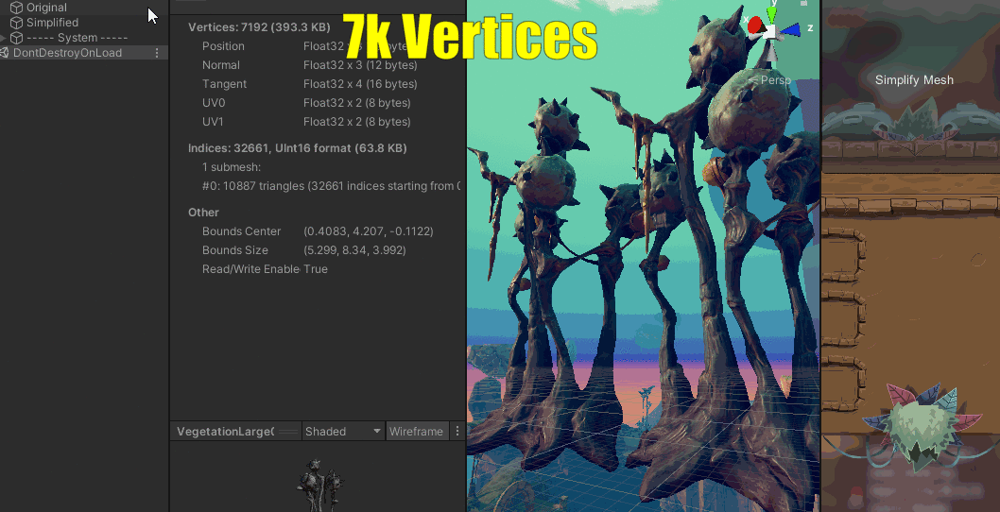

# UnityMeshSimplifier


## Installation into Unity project

You will find different methods of installing this library into your Unity project [here](https://github.com/Whinarn/UnityMeshSimplifier/wiki#installing).

## How to use

If you are not a programmer look into the [LOD Generator Helper component](https://github.com/Whinarn/UnityMeshSimplifier/wiki/LOD-Generator-Helper-component).

For programmers you will find documentation for the [Mesh Simplifier API](https://github.com/Whinarn/UnityMeshSimplifier/wiki/Mesh-Simplifier-API) and the [LOD Generator API](https://github.com/Whinarn/UnityMeshSimplifier/wiki/LOD-Generator-API) useful.

## The Smart Linking feature

In order to solve artifacts in the mesh simplification process where holes or other serious issues could arise, a new feature called smart linking has been introduced. This feature is enabled by default but can be disabled through the `EnableSmartLink` field on the `SimplificationOptions` struct appled to the `MeshSimplifier` class through the `SimplificationOptions` property. Disabling this could give you a minor performance gain in cases where you do not need this.

The `VertexLinkDistance` field on the `SimplificationOptions` struct could be also be used to change the maximum distance between two vertices for the linking. The default value is `double.Epsilon`. This value maximum distance is intended to be very small, but you might need to increase it for large scale meshes.


Reducing Mesh Poly Count
------------------------

To reduce the vertex count of a game object containing a mesh renderer and a mesh filter, you just need to invoke the **Mesh Simplifier API** on the mesh itself.

Ideally, you can develop a custom inspector to make this poly count reduction.

You can do that.

But for this example I will merely prototype an OnGUI function so you can see how the mesh reduction works in run-time.

Here's my code\:

    void OnGUI()
    {
        if (GUI.Button(Rect.MinMaxRect(0, 0, 200, 200),"Simplify Mesh"))
        {
            var originalMesh = GetComponent().sharedMesh;
            float quality = 0.2f;
            var meshSimplifier = new UnityMeshSimplifier.MeshSimplifier();
            meshSimplifier.Initialize(originalMesh);
            meshSimplifier.SimplifyMesh(quality);
            var destMesh = meshSimplifier.ToMesh();
            GetComponent().sharedMesh = destMesh;
        }
    }


See what happens next:



_Unity Mesh Simplifier Example_

At quality 0.2, we reduced the vertex count of this sample mesh from 7k to 2.5k... in run-time.

_lower quality = lower poly count = worse visuals = louder LOLs = higher performance_

It works fairly well for reductions with _quality_ above 0.5. Below that number, your mesh will start breaking apart.


[insert video here]

Code used in video

```csharp
using System.Collections;
using System.Collections.Generic;
using UnityEditor;
using UnityEngine;
using UnityEngine.Serialization;

public class MeshSimplify : MonoBehaviour
{
    public float quality = 0.5f;


    void OnGUI()
    {
           if (GUI.Button(Rect.MinMaxRect(0, 0, 200, 200),"Simplify Mesh"))
           {
                var originalMesh = GetComponent<MeshFilter>().sharedMesh;
                var meshSimplifier = new UnityMeshSimplifier.MeshSimplifier();
                meshSimplifier.Initialize(originalMesh);
                meshSimplifier.SimplifyMesh(quality);
                var destMesh = meshSimplifier.ToMesh();
                GetComponent<MeshFilter>().sharedMesh = destMesh;
           }
    }
}
```


## Potential problems and solutions

### I'm missing XML documentation in my project

If you have installed this library through the Git URL in the Unity package manager, then you will likely see this problem.
The solution is quite simple however. Open up your Unity Editor, go to `Edit` > `Preferences` and then under `External Tools` you will have multiple options under `Generate .csproj files for:`. Now simply make sure that Git packages and whatever other kind of package is selected here. You should now see the XML documentation for the API show up in your code editor after having also clicked `Regenerate project files`.

### My decimated meshes have holes

The original algorithm that was ported from C++ did not support situations where multiple vertices shared the same position, instead of being treated as one vertex they were treated individually. This would then end up creating visible holes in the mesh where the vertices were not connected through triangles.

There are several ways to solve this problem. The smart linking feature (mentioned above) is enabled by default and should take care of most of these problems for you. But there are also options to preserve borders, seams and UV foldovers. The properties *PreserveBorders*, *PreserveSeams* and *PreserveFoldovers* will preserve some vertices from being decimated, strongly limiting the decimation algorithm, but should prevent holes in most situations.

The recommendation is to use the smart linking feature that is enabled by default, but the options for preservation exists in those cases where you may want it.

### Some objects are not animated correctly after I have generated LOD Groups

The most probable cause for this is that you have objects that are parented under bones that will move with the animations. Currently there is no code to deal with this, and the best way to do this is to use nested LOD Groups. Any such object that you know is parented under a bone should have its own LOD Group.

### The Unity-generated Visual Studio solution file appears broken

This can be a problem because of an assembly definition provided with this repository, if you are using Unity 2017.3 or above. Make sure that you have the latest version of [Visual Studio Tools for Unity](https://www.visualstudio.com/vs/unity-tools/). If you are using Visual Studio 2017, make sure that Visual Studio is up to date and that you have installed the *Game development with Unity* component. For other versions of Visual Studio you would have to download a separate installer. Please go to the [Microsoft Documentation](https://docs.microsoft.com/en-us/visualstudio/cross-platform/getting-started-with-visual-studio-tools-for-unity) for more information.
